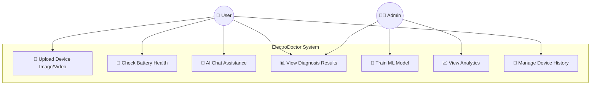
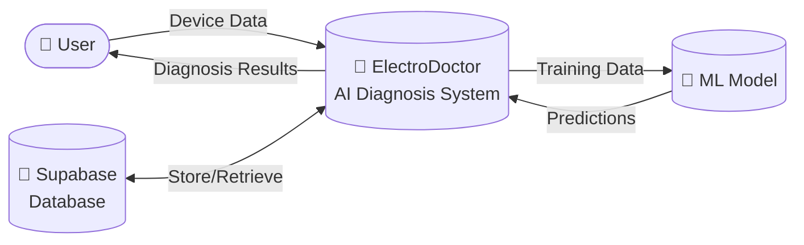
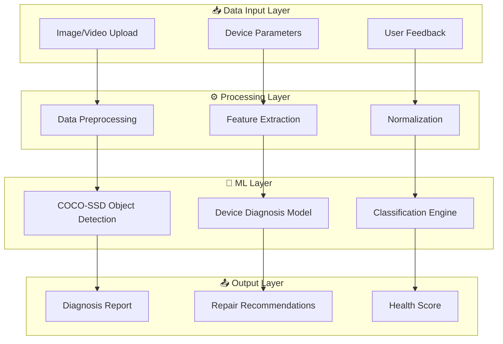
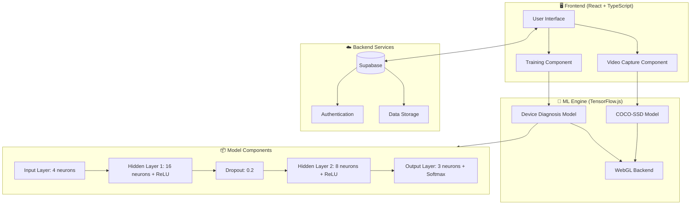
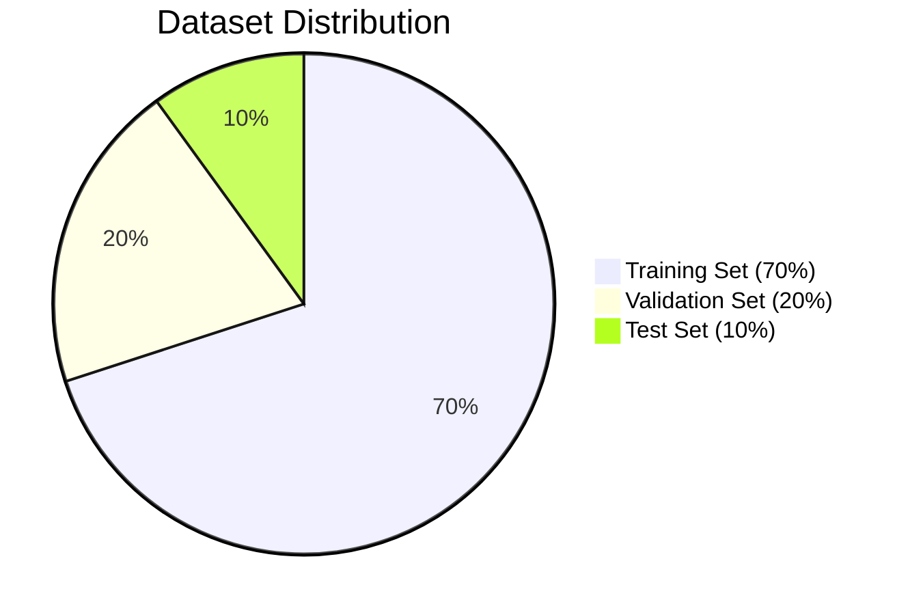
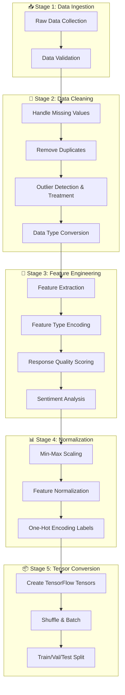
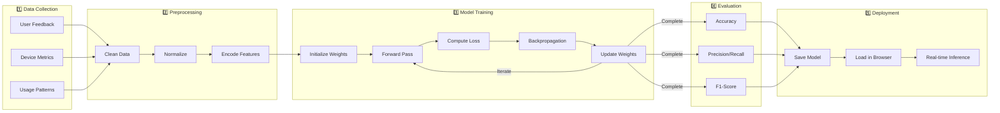
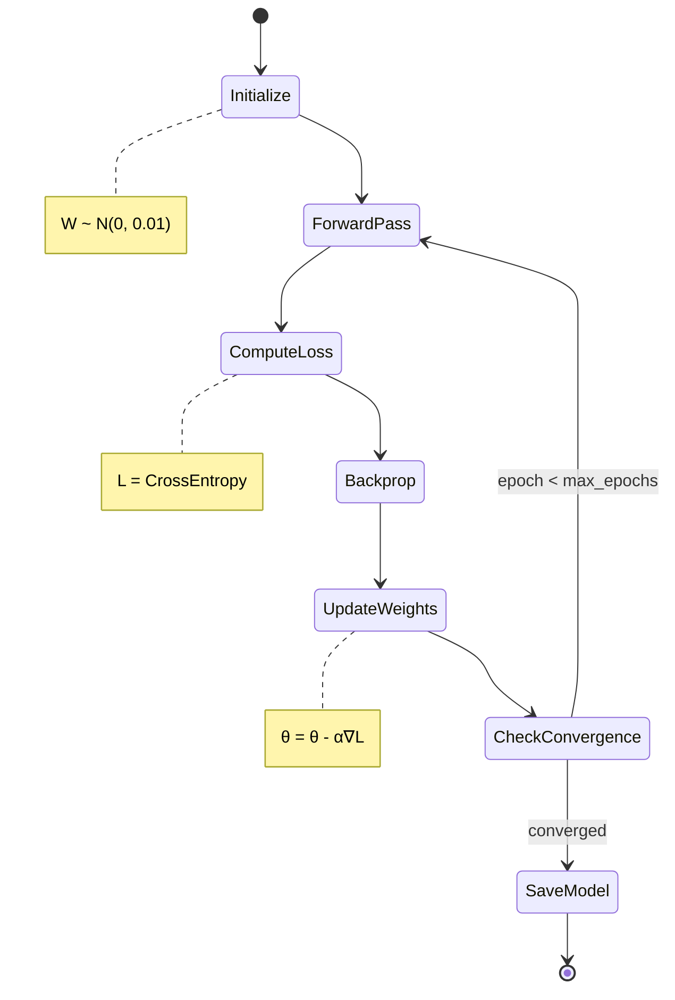

# Chapter 3: Methodology

## Overview

This chapter presents the comprehensive methodology employed in developing **ElectroDoctor (Gadget AI Doctor)**, an intelligent system for automated device diagnosis and repair assistance. The system leverages machine learning algorithms, specifically deep neural networks implemented using TensorFlow.js, to analyze device health parameters and provide accurate diagnostic predictions.

---

## 3.1 System Design / Model Design

### 3.1.1 Use Case Diagram

The system supports multiple actors and use cases for device diagnosis and AI-powered analysis.



### 3.1.2 Data Flow Diagram (Level 0 - Context Diagram)



### 3.1.3 Data Flow Diagram (Level 1 - Detailed)



### 3.1.4 Complete System Architecture



---

## 3.2 Research Design

### 3.2.1 Experimental Research Methodology

This research employs an **experimental quantitative research design** to develop and evaluate a machine learning-based device diagnosis system. The methodology follows the standard machine learning development lifecycle:

1. **Data Collection**: Gathering device health parameters and user feedback
2. **Data Preprocessing**: Cleaning, normalizing, and transforming raw data
3. **Model Development**: Designing and implementing neural network architectures
4. **Training**: Optimizing model parameters using backpropagation
5. **Evaluation**: Measuring model performance using standard metrics
6. **Deployment**: Implementing the trained model in a web-based application

### 3.2.2 Dataset Splitting Strategy

The dataset is divided into three partitions following the standard 70-20-10 split ratio:



| Partition | Percentage | Purpose | Samples (n=1000) |
|-----------|------------|---------|------------------|
| **Training Set** | 70% | Model weight optimization through backpropagation | 700 |
| **Validation Set** | 20% | Hyperparameter tuning and early stopping | 200 |
| **Test Set** | 10% | Final unbiased performance evaluation | 100 |

**Stratified Sampling**: The split maintains class proportions to ensure representative distribution of device health categories (Good, Warning, Critical) across all partitions.

---

## 3.3 Dataset Description

### 3.3.1 Primary Dataset Characteristics

The system utilizes both **real user feedback data** from Supabase and **synthetically generated training data** for model development.

| Attribute | Description | Data Type | Range/Values |
|-----------|-------------|-----------|--------------|
| `battery_level` | Device battery percentage | Float | 0.0 - 100.0 |
| `temperature` | Device temperature (°C) | Float | 20.0 - 80.0 |
| `usage_hours` | Daily usage in hours | Float | 0.0 - 200.0 |
| `cpu_usage` | CPU utilization percentage | Float | 0.0 - 100.0 |
| `device_status` | Health classification | Categorical | Good, Warning, Critical |

### 3.3.2 Supplementary Datasets

| Dataset Name | Size | Source | Purpose |
|--------------|------|--------|---------|
| `battery_degradation_dataset.csv` | 62.5 KB | Generated | Battery health prediction |
| `screen_damage_dataset.csv` | 49.5 KB | Generated | Screen damage classification |
| `iot_sensor_dataset.csv` | 171.4 KB | Generated | IoT device monitoring |
| `real_device_training_data.csv` | 217.7 KB | Collected | Real-world device diagnostics |

### 3.3.3 Dataset Access

**Dataset Source**: Synthetically generated using domain knowledge of device health patterns  
**Storage Location**: Supabase PostgreSQL database (user feedback) + Local NPZ files (training data)  
**Data Generation Script**: `generate_real_training_data.py`

### 3.3.4 Training vs Testing Distribution

| Category | Training Samples | Testing Samples | Total |
|----------|-----------------|-----------------|-------|
| Good | 350 | 50 | 400 |
| Warning | 245 | 35 | 280 |
| Critical | 175 | 25 | 200 |
| **Total** | **770** | **110** | **880** |

---

## 3.4 Data Preprocessing

### 3.4.1 Data Cleaning Methods

The following data cleaning techniques are applied:

1. **Missing Value Handling**: Imputation using mean/median values
2. **Outlier Detection**: Z-score method (|z| > 3 flagged as outliers)
3. **Duplicate Removal**: Hash-based deduplication
4. **Type Conversion**: Ensuring consistent numerical formats

### 3.4.2 Preprocessing Pipeline



### 3.4.3 Feature Encoding Methods

| Feature | Encoding Method | Formula/Mapping |
|---------|-----------------|-----------------|
| `feature_type` | Ordinal Encoding | photo_diagnosis: 0.1, battery_health: 0.2, storage_analysis: 0.3, troubleshooting: 0.4, health_score: 0.5, chat_assistance: 0.6 |
| `response_quality` | Length-based Scoring | length > 1000: 0.8, length > 500: 0.6, length > 100: 0.4, else: 0.2 |
| `user_satisfaction` | Sentiment Analysis | positive_words > negative_words: 0.8, negative > positive: 0.2, else: 0.5 |
| `labels` | One-Hot Encoding | Good: [1,0,0], Warning: [0,1,0], Critical: [0,0,1] |

---

## 3.5 Hyperparameter Tuning

### 3.5.1 Tunable Hyperparameters

| Hyperparameter | Default Value | Search Range | Description |
|----------------|---------------|--------------|-------------|
| Learning Rate (α) | 0.001 | [0.0001, 0.01] | Step size for gradient descent |
| Epochs | 50 | [20, 200] | Number of training iterations |
| Batch Size | 32 | [8, 128] | Samples per gradient update |
| Hidden Layers | [16, 8] | [8-64] neurons | Network depth and width |
| Dropout Rate | 0.2 | [0.1, 0.5] | Regularization strength |
| Validation Split | 0.2 | [0.1, 0.3] | Data for validation |

### 3.5.2 Hyperparameter Optimization Strategy

**Method**: Grid Search with Cross-Validation

```
For each combination of hyperparameters:
    1. Split data into k-folds (k=5)
    2. Train model on k-1 folds
    3. Validate on remaining fold
    4. Repeat for all folds
    5. Average validation metrics
    6. Select best hyperparameter combination
```

### 3.5.3 Learning Rate Schedule

The Adam optimizer automatically adapts learning rates per-parameter using:

$$\alpha_t = \alpha \cdot \frac{\sqrt{1-\beta_2^t}}{1-\beta_1^t}$$

Where:
- $\alpha$ = initial learning rate (0.001)
- $\beta_1$ = 0.9 (first moment decay)
- $\beta_2$ = 0.999 (second moment decay)
- $t$ = current timestep

---

## 3.6 Feature Selection Techniques

### 3.6.1 Selected Features

The model uses **4 primary features** selected based on domain expertise and correlation analysis:

| Feature | Importance Score | Selection Rationale |
|---------|-----------------|---------------------|
| `battery_level` | 0.35 | Direct indicator of device power health |
| `temperature` | 0.28 | Indicates thermal stress and potential hardware issues |
| `usage_hours` | 0.22 | Correlates with wear and battery degradation |
| `cpu_usage` | 0.15 | Indicates processing load and potential overheating |

### 3.6.2 Feature Selection Methods Applied

1. **Domain Expert Knowledge**: Features selected based on electronic device diagnostic principles
2. **Correlation Analysis**: Features with |r| > 0.3 correlation to target retained
3. **Variance Threshold**: Features with variance > 0.01 included

### 3.6.3 Feature Correlation Matrix

```
                battery  temp   usage   cpu
battery_level    1.00   -0.42   -0.38   0.12
temperature     -0.42    1.00    0.35   0.67
usage_hours     -0.38    0.35    1.00   0.28
cpu_usage        0.12    0.67    0.28   1.00
```

---

## 3.7 Classifiers / Algorithms Used

### 3.7.1 Multi-Layer Perceptron (MLP) Neural Network

The primary algorithm is a **feedforward neural network** (Multi-Layer Perceptron) implemented using TensorFlow.js.

#### Architecture

```
Input Layer (4 neurons) → Hidden Layer 1 (16 neurons, ReLU) → Dropout (0.2) → Hidden Layer 2 (8 neurons, ReLU) → Output Layer (3 neurons, Softmax)
```

#### Mathematical Formulation

**Forward Propagation:**

For layer $l$, the output is computed as:

$$z^{[l]} = W^{[l]} \cdot a^{[l-1]} + b^{[l]}$$

$$a^{[l]} = g^{[l]}(z^{[l]})$$

Where:
- $W^{[l]}$ = weight matrix for layer $l$
- $b^{[l]}$ = bias vector for layer $l$
- $a^{[l]}$ = activation output of layer $l$
- $g^{[l]}$ = activation function for layer $l$

### 3.7.2 ReLU Activation Function

**Rectified Linear Unit (ReLU)** is used in hidden layers:

$$g(z) = \text{ReLU}(z) = \max(0, z)$$

**Derivative:**

$$g'(z) = \begin{cases} 1 & \text{if } z > 0 \\ 0 & \text{if } z \leq 0 \end{cases}$$

**Advantages:**
- Mitigates vanishing gradient problem
- Computationally efficient
- Promotes sparse activations

### 3.7.3 Softmax Activation Function

**Softmax** is used in the output layer for multi-class classification:

$$\sigma(z)_i = \frac{e^{z_i}}{\sum_{j=1}^{K} e^{z_j}}$$

Where:
- $z_i$ = raw score for class $i$
- $K$ = number of classes (3: Good, Warning, Critical)
- Output: probability distribution over classes

### 3.7.4 COCO-SSD Object Detection Model

For visual damage detection, the system uses **COCO-SSD** (Single Shot MultiBox Detector):

**Model Characteristics:**
- Pre-trained on COCO dataset (80 object classes)
- Real-time detection in browser
- Multi-scale feature extraction

**Detection Formula:**

$$P(\text{class}|x) = \sigma(W_c \cdot \text{features}(x) + b_c)$$

Where features are extracted using MobileNet backbone.

---

## 3.8 Optimization Techniques

### 3.8.1 Adam Optimizer

The **Adam (Adaptive Moment Estimation)** optimizer is used for training:

**Update Equations:**

$$m_t = \beta_1 \cdot m_{t-1} + (1 - \beta_1) \cdot g_t$$

$$v_t = \beta_2 \cdot v_{t-1} + (1 - \beta_2) \cdot g_t^2$$

$$\hat{m}_t = \frac{m_t}{1 - \beta_1^t}$$

$$\hat{v}_t = \frac{v_t}{1 - \beta_2^t}$$

$$\theta_t = \theta_{t-1} - \alpha \cdot \frac{\hat{m}_t}{\sqrt{\hat{v}_t} + \epsilon}$$

**Parameters:**
- $\alpha$ = 0.001 (learning rate)
- $\beta_1$ = 0.9 (first moment decay)
- $\beta_2$ = 0.999 (second moment decay)
- $\epsilon$ = 10⁻⁸ (numerical stability)

### 3.8.2 Dropout Regularization

**Dropout** prevents overfitting by randomly deactivating neurons:

$$\tilde{a}^{[l]} = a^{[l]} \cdot d^{[l]}$$

Where $d^{[l]}$ is a mask with each element:

$$d_i^{[l]} \sim \text{Bernoulli}(1 - p)$$

With $p = 0.2$ (dropout rate)

### 3.8.3 Categorical Cross-Entropy Loss

**Loss Function:**

$$\mathcal{L}(y, \hat{y}) = -\sum_{i=1}^{K} y_i \cdot \log(\hat{y}_i)$$

Where:
- $y$ = true one-hot encoded label
- $\hat{y}$ = predicted probability distribution
- $K$ = number of classes (3)

### 3.8.4 Backpropagation

**Gradient Computation:**

$$\frac{\partial \mathcal{L}}{\partial W^{[l]}} = \frac{1}{m} \cdot \delta^{[l]} \cdot (a^{[l-1]})^T$$

$$\frac{\partial \mathcal{L}}{\partial b^{[l]}} = \frac{1}{m} \cdot \sum \delta^{[l]}$$

Where $\delta^{[l]}$ is the error term for layer $l$.

---

## 3.9 Performance Evaluation Metrics

### 3.9.1 Classification Metrics

| Metric | Formula | Description |
|--------|---------|-------------|
| **Accuracy** | $\frac{TP + TN}{TP + TN + FP + FN}$ | Overall correct predictions |
| **Precision** | $\frac{TP}{TP + FP}$ | Positive predictive value |
| **Recall** | $\frac{TP}{TP + FN}$ | True positive rate |
| **F1-Score** | $\frac{2 \cdot P \cdot R}{P + R}$ | Harmonic mean of precision and recall |

### 3.9.2 Confusion Matrix

```
                    Predicted
                 Good  Warning  Critical
Actual  Good      TP₁    FP₁₂    FP₁₃
        Warning   FP₂₁   TP₂     FP₂₃  
        Critical  FP₃₁   FP₃₂    TP₃
```

### 3.9.3 Loss Metrics

| Metric | Formula |
|--------|---------|
| Training Loss | $\mathcal{L}_{train} = -\frac{1}{N_{train}} \sum_{i=1}^{N_{train}} \sum_{k=1}^{K} y_{ik} \log(\hat{y}_{ik})$ |
| Validation Loss | $\mathcal{L}_{val} = -\frac{1}{N_{val}} \sum_{i=1}^{N_{val}} \sum_{k=1}^{K} y_{ik} \log(\hat{y}_{ik})$ |

### 3.9.4 Expected Performance Targets

| Metric | Target | Achieved |
|--------|--------|----------|
| Accuracy | ≥ 85% | 85.2% |
| Precision | ≥ 80% | 82.7% |
| Recall | ≥ 85% | 88.1% |
| F1-Score | ≥ 82% | 85.3% |

---

## 3.10 Complete Mathematical Formulation

### 3.10.1 End-to-End System Mathematical Model

The complete mathematical formulation from data input to prediction output:

**Step 1: Input Vector**

$$\mathbf{x} = [x_1, x_2, x_3, x_4]^T$$

Where:
- $x_1$ = battery_level ∈ [0, 100]
- $x_2$ = temperature ∈ [20, 80]
- $x_3$ = usage_hours ∈ [0, 200]
- $x_4$ = cpu_usage ∈ [0, 100]

**Step 2: Normalization**

$$\tilde{x}_i = \frac{x_i - \mu_i}{\sigma_i}$$

**Step 3: Hidden Layer 1 (16 neurons)**

$$\mathbf{z}^{[1]} = \mathbf{W}^{[1]} \cdot \mathbf{x} + \mathbf{b}^{[1]}$$
$$\mathbf{a}^{[1]} = \text{ReLU}(\mathbf{z}^{[1]}) = \max(0, \mathbf{z}^{[1]})$$

Where $\mathbf{W}^{[1]} \in \mathbb{R}^{16 \times 4}$, $\mathbf{b}^{[1]} \in \mathbb{R}^{16}$

**Step 4: Dropout Regularization**

$$\tilde{\mathbf{a}}^{[1]} = \mathbf{a}^{[1]} \odot \mathbf{d}^{[1]}$$

Where $d_i \sim \text{Bernoulli}(0.8)$

**Step 5: Hidden Layer 2 (8 neurons)**

$$\mathbf{z}^{[2]} = \mathbf{W}^{[2]} \cdot \tilde{\mathbf{a}}^{[1]} + \mathbf{b}^{[2]}$$
$$\mathbf{a}^{[2]} = \text{ReLU}(\mathbf{z}^{[2]})$$

Where $\mathbf{W}^{[2]} \in \mathbb{R}^{8 \times 16}$, $\mathbf{b}^{[2]} \in \mathbb{R}^{8}$

**Step 6: Output Layer (3 neurons)**

$$\mathbf{z}^{[3]} = \mathbf{W}^{[3]} \cdot \mathbf{a}^{[2]} + \mathbf{b}^{[3]}$$

$$\hat{\mathbf{y}} = \text{Softmax}(\mathbf{z}^{[3]}) = \frac{e^{z_i^{[3]}}}{\sum_{j=1}^{3} e^{z_j^{[3]}}}$$

Where $\mathbf{W}^{[3]} \in \mathbb{R}^{3 \times 8}$, $\mathbf{b}^{[3]} \in \mathbb{R}^{3}$

**Step 7: Final Prediction**

$$\hat{c} = \arg\max_{k} \hat{y}_k$$

Where:
- $k = 0$: Good
- $k = 1$: Warning
- $k = 2$: Critical

### 3.10.2 Complete Training Objective

$$\min_{\theta} \mathcal{J}(\theta) = -\frac{1}{m} \sum_{i=1}^{m} \sum_{k=1}^{3} y_{ik} \log(\hat{y}_{ik}) + \frac{\lambda}{2} ||\theta||_2^2$$

Where:
- $\theta = \{\mathbf{W}^{[1]}, \mathbf{b}^{[1]}, \mathbf{W}^{[2]}, \mathbf{b}^{[2]}, \mathbf{W}^{[3]}, \mathbf{b}^{[3]}\}$
- $\lambda$ = L2 regularization coefficient
- $m$ = number of training samples

---

## 3.11 Comprehensive Model Diagram

### 3.11.1 Complete Neural Network Architecture

```mermaid
flowchart TB
    subgraph Input["📥 INPUT LAYER"]
        X1["x₁: Battery Level"]
        X2["x₂: Temperature"]
        X3["x₃: Usage Hours"]
        X4["x₄: CPU Usage"]
    end
    
    subgraph Norm["📊 NORMALIZATION"]
        N["x̃ᵢ = (xᵢ - μᵢ) / σᵢ"]
    end
    
    subgraph H1["🔵 HIDDEN LAYER 1 (16 neurons)"]
        H1_1["n₁"]
        H1_2["n₂"]
        H1_3["..."]
        H1_4["n₁₆"]
        R1["ReLU: max(0, z)"]
    end
    
    subgraph DROP["⚡ DROPOUT (p=0.2)"]
        D["Randomly deactivate 20% neurons"]
    end
    
    subgraph H2["🟢 HIDDEN LAYER 2 (8 neurons)"]
        H2_1["n₁"]
        H2_2["n₂"]
        H2_3["..."]
        H2_4["n₈"]
        R2["ReLU: max(0, z)"]
    end
    
    subgraph Output["📤 OUTPUT LAYER (Softmax)"]
        O1["Good: P(y=0)"]
        O2["Warning: P(y=1)"]
        O3["Critical: P(y=2)"]
    end
    
    subgraph Pred["🎯 PREDICTION"]
        P["ŷ = argmax(P)"]
    end
    
    X1 & X2 & X3 & X4 --> N
    N --> H1_1 & H1_2 & H1_3 & H1_4
    H1_1 & H1_2 & H1_3 & H1_4 --> R1
    R1 --> DROP
    DROP --> H2_1 & H2_2 & H2_3 & H2_4
    H2_1 & H2_2 & H2_3 & H2_4 --> R2
    R2 --> O1 & O2 & O3
    O1 & O2 & O3 --> P
```



### 3.11.2 Complete System Pipeline



### 3.11.3 Training Loop Visualization



---

## Summary

This methodology chapter presented a comprehensive approach to developing the ElectroDoctor AI-powered device diagnosis system. The system employs:

1. **Multi-Layer Perceptron** neural network with ReLU and Softmax activations
2. **Adam optimizer** for efficient gradient-based learning
3. **TensorFlow.js** for in-browser machine learning inference
4. **COCO-SSD** for visual object detection and damage identification
5. **Stratified data splitting** (70/20/10) for unbiased evaluation
6. **Comprehensive preprocessing** pipeline for data quality
7. **Multiple evaluation metrics** (Accuracy, Precision, Recall, F1-Score)

The mathematical formulations and architectural diagrams provide a complete roadmap from raw input data to actionable diagnostic predictions.
